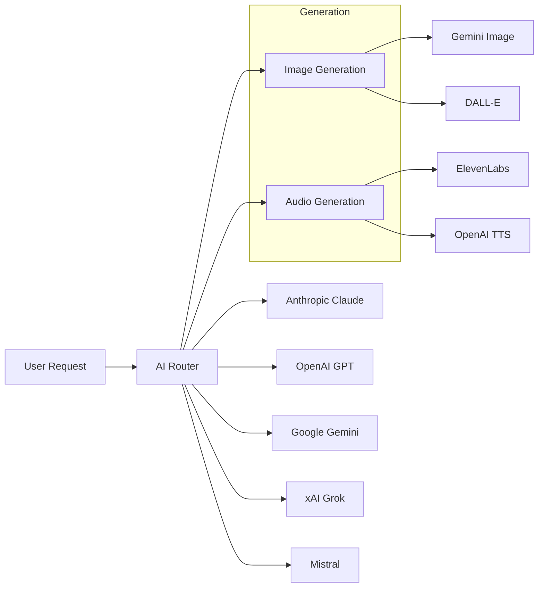

# Integrations

Impact Learning integrates with leading AI providers, cloud services, and tools to deliver powerful learning content generation. This section covers all available integrations and how they work together.

## Integration Overview

| Category | Purpose | Examples |
|----------|---------|----------|
| **AI Model Providers** | Power content generation, reasoning, and code | Anthropic, OpenAI, Google, xAI, Mistral |
| **Image Generation** | Create custom visuals for learning content | Google Gemini, OpenAI DALL-E |
| **Audio Generation** | Generate narration and speech | ElevenLabs, OpenAI TTS |
| **Web Search** | Find current information for content | Exa Labs |
| **Storage & Auth** | Persist data and manage users | Supabase |
| **Sandbox Execution** | Run and preview generated code | Modal |

## How Integrations Work

Impact uses a **unified AI routing layer** that allows you to choose the best model for each task:

## Available Integrations

<Cards>
  <Card title="AI Model Providers" href="/docs/integrations/ai-models">
    Claude, GPT, Gemini, Grok, and Mistral models for content generation
  </Card>
  <Card title="Image Generation" href="/docs/integrations/image-generation">
    Generate custom images with Gemini and DALL-E
  </Card>
  <Card title="Audio Generation" href="/docs/integrations/audio-generation">
    Create narration with ElevenLabs and OpenAI TTS
  </Card>
  <Card title="Supabase" href="/docs/integrations/supabase">
    Database, authentication, and file storage
  </Card>
</Cards>
