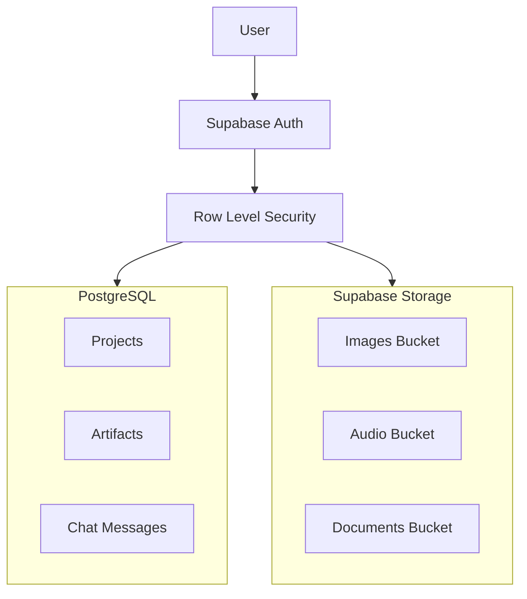

# Supabase

Impact Learning uses [Supabase](https://supabase.com) as its backend infrastructure, providing database storage, user authentication, and file management.

## What Supabase Provides

### Database (PostgreSQL)

All your learning content is stored in a PostgreSQL database with:

- **Projects and chats** — Your conversation history and generated content
- **Artifacts** — Generated components, images, audio, and documents
- **User profiles** — Account information and preferences
- **Templates** — Starter templates for different learning formats

### Authentication

Secure user authentication including:

- Email and password login
- Session management
- Row-Level Security (RLS) ensuring you only access your own data

### File Storage

Persistent storage for all generated and uploaded assets:

- **Images** — Generated and uploaded images
- **Audio** — Generated narration files
- **Documents** — PDFs, markdown files, and other uploads
- **Videos** — Uploaded video content

All files are stored with signed URLs that automatically refresh for security.

## How It Works

## Security

### Row-Level Security

Supabase RLS ensures that:

- You can only view and edit your own projects
- Shared content is controlled by explicit permissions
- API access is scoped to authenticated users

### Signed URLs

All file downloads use signed URLs that:

- Expire after a set period (typically 30 days)
- Are automatically refreshed when needed
- Cannot be guessed or enumerated

## Data Persistence

Your work in Impact Learning is automatically saved:

- **Real-time saving** — Changes are persisted as you work
- **Cross-device access** — Access your projects from any device
- **Version history** — Chat history preserves all iterations

<Callout type="info">
Your data is stored securely in Supabase's infrastructure. Impact Learning does not access your content for AI training unless you explicitly opt in (Business plan feature).
</Callout>
